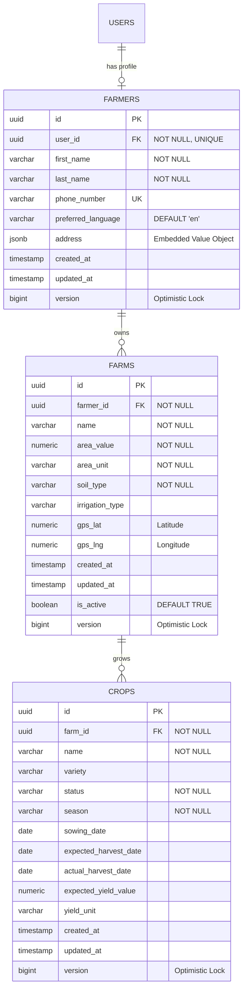
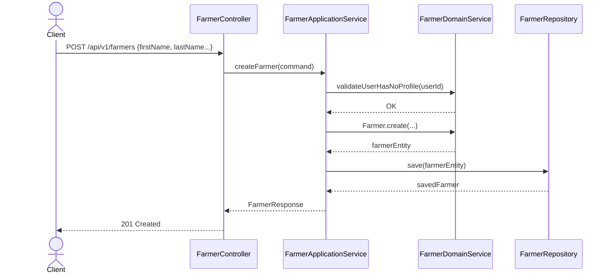
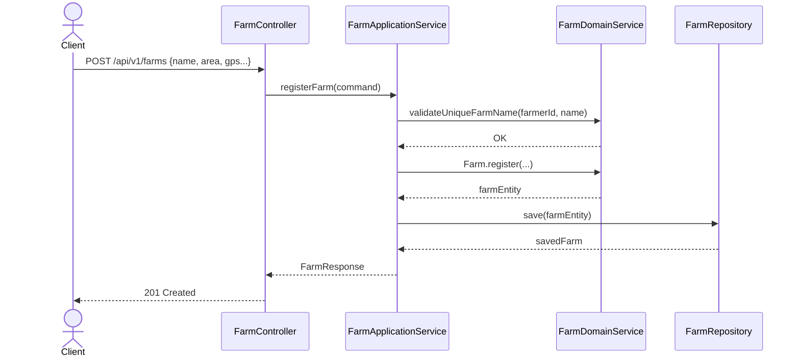
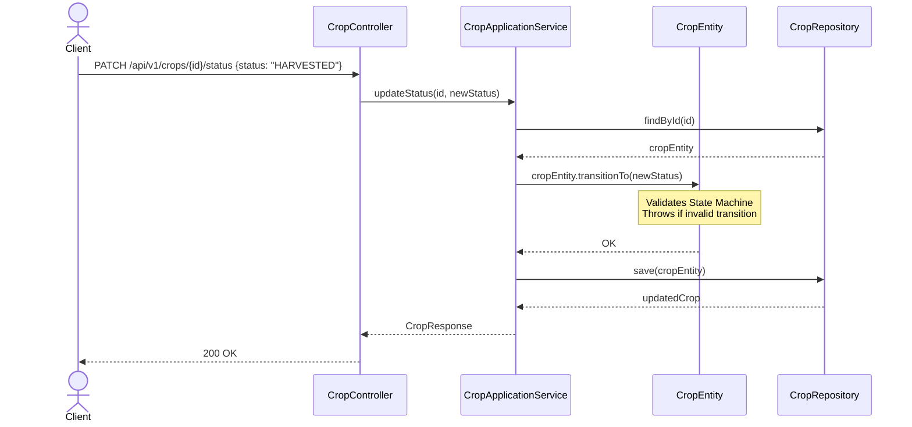

# Domain Design — Farmer, Farm, Crop

## 1. Domain Model

The `Farmer`, `Farm`, and `Crop` concepts belong to the core operational domain of the AI Farmer Companion. 

### Domain Elements

*   **Aggregate Roots (AR):** `Farmer`, `Farm`, `Crop`
*   **Entities:** None (Internal entities are not required as the ARs themselves are flat enough, but conceptually `Crop` could be an entity under `Farm` if we chose a different aggregate design. See Section 2.)
*   **Value Objects (VO):** `Address`, `ContactInformation`, `GpsCoordinates`, `LandArea`, `SoilType`, `CropType`, `CropSeason`, `CropStatus`
*   **Domain Services:** `FarmRegistrationDomainService`, `CropLifecycleDomainService`
*   **Repository Interfaces:** `FarmerRepository`, `FarmRepository`, `CropRepository`

**Why this breakdown?**
In Domain-Driven Design (DDD), an Aggregate is a transactional consistency boundary. By treating each as its own Aggregate Root, we ensure that changes to a crop's status do not require locking the entire farm or the farmer's profile. This reduces contention and allows the system to scale horizontally.

---

## 2. Aggregate Design

### Options Considered
1.  **Farmer as a giant Aggregate Root:** The `Farmer` holds a list of `Farm`s, which hold lists of `Crop`s.
    *   *Tradeoff:* Huge performance bottleneck. Loading a farmer would load all farms and historical crops. Concurrent crop updates would cause optimistic locking failures on the Farmer.
2.  **Farm as the Aggregate Root, Crop as Entity:**
    *   *Tradeoff:* Better, but crops have their own distinct lifecycle, seasons, and eventually AI predictions. Locking the `Farm` to update a `Crop`'s status is unnecessary.
3.  **Farmer, Farm, and Crop as separate Aggregate Roots (Recommended):**
    *   *Tradeoff:* Highly decoupled. Requires eventual consistency or domain services for complex validations, but offers the best performance, scalability, and microservice-readiness. They reference each other by ID (e.g., Farm holds `farmerId`, Crop holds `farmId`).

### Recommendation
**Use separate Aggregate Roots.** 
*   `Farmer` (AR) -> References `UserId`
*   `Farm` (AR) -> References `FarmerId`
*   `Crop` (AR) -> References `FarmId`

---

## 3. Entity Relationships

```text
User
  1 
  | 
  | (1-to-1)
  | 
  1 
Farmer
  1 
  | 
  | (1-to-Many)
  | 
  * 
Farm
  1 
  | 
  | (1-to-Many)
  | 
  * 
Crop
```

**Cardinality Justification:**
*   **User (1) to Farmer (1):** A user account represents a single farmer profile. Authentication is handled via the User, domain actions via the Farmer.
*   **Farmer (1) to Farm (*):** A farmer can own or lease multiple geographically separated farms.
*   **Farm (1) to Crop (*):** A farm will host multiple crops over time (across different seasons/years).

---

## 4. Value Objects

Value Objects encapsulate attributes that have no conceptual identity and are immutable.

| Value Object | Attributes | Rationale & Rules |
| :--- | :--- | :--- |
| **Address** | `street`, `city`, `state`, `country`, `zipCode` | A standard address structure. Immutable. Replaced entirely if moved. |
| **ContactInfo** | `phoneNumber`, `email` | Encapsulates contact details. Validates phone format and email format. |
| **GpsCoordinates** | `latitude`, `longitude` | Represents an exact location on Earth. Validates bounds (-90 to 90, -180 to 180). |
| **LandArea** | `value`, `unit` (Enum: HECTARE, ACRE) | Encapsulates measurement and unit to prevent calculation errors. Cannot be negative. |
| **SoilType** | `Enum` (LOAMY, CLAY, SANDY, etc.) | Standardized soil classifications for AI recommendations. |
| **CropType** | `name`, `scientificName`, `variety` | Defines exactly what is being grown. |
| **CropStatus** | `Enum` (PLANNED, SOWN, VEGETATIVE, FLOWERING, HARVESTED, FAILED) | Lifecycle tracking. Follows strict state machine transitions. |

---

## 5. Database Design

### ER Diagram



**Constraints & Indexes:**
*   `farmers.user_id` -> UNIQUE (One profile per user).
*   `farms` -> UNIQUE constraint on `(farmer_id, name)` (A farmer cannot have two farms with the same name).
*   Foreign Keys with `ON DELETE RESTRICT` to prevent accidental orphaned records.
*   Indexes on `farmer_id` (in `farms`), `farm_id` (in `crops`), and `status` (in `crops`) for fast lookups.

---

## 6. Business Rules

> [!IMPORTANT]
> These rules are enforced in the **Domain Layer** (Entities & Domain Services), never in the presentation layer.

1.  **Farmer Rules:**
    *   A Farmer cannot be created without a valid existing `UserId`.
    *   Contact phone numbers must be unique across all farmers.
2.  **Farm Rules:**
    *   A Farm must belong to a valid `FarmerId`.
    *   Multiple Farms owned by the *same* Farmer cannot have the same `name`.
    *   Land area cannot be <= 0.
    *   A Farm cannot be deleted or deactivated if it contains crops that are actively growing (Status != HARVESTED/FAILED).
3.  **Crop Rules:**
    *   `sowing_date` cannot be in the future.
    *   `expected_harvest_date` MUST be after `sowing_date`.
    *   Crop state transitions must follow a strict path: `PLANNED -> SOWN -> VEGETATIVE -> FLOWERING -> HARVESTED`. Any state can transition to `FAILED`.
    *   Multiple active crops *can* exist on the same farm (intercropping or multiple fields).
    *   A Crop cannot be deleted if it is in `HARVESTED` or `FAILED` status (kept for historical yield analysis).

---

## 7. REST API Design (API Contracts)

Endpoints are versioned (`/api/v1/`) and require JWT Bearer authentication.

### Farmer API
*   `POST /api/v1/farmers` (Create profile for current authenticated User)
*   `GET /api/v1/farmers/me` (Get current farmer profile)
*   `PUT /api/v1/farmers/me` (Update profile)

### Farm API
*   `POST /api/v1/farms` (Register a new farm)
*   `GET /api/v1/farms` (List all farms for the current farmer)
*   `GET /api/v1/farms/{farmId}` (Get specific farm details)
*   `PUT /api/v1/farms/{farmId}` (Update farm details)
*   `DELETE /api/v1/farms/{farmId}` (Deactivate farm - Soft delete)

### Crop API
*   `POST /api/v1/farms/{farmId}/crops` (Add a crop to a farm)
*   `GET /api/v1/farms/{farmId}/crops` (List all crops for a farm, supports filters like `?status=ACTIVE`)
*   `GET /api/v1/crops/{cropId}` (Get specific crop)
*   `PATCH /api/v1/crops/{cropId}/status` (Update lifecycle status)
*   `PUT /api/v1/crops/{cropId}` (Update crop details)

---

## 8. Sequence Diagrams

### Create Farmer Profile


### Register Farm


### Update Crop Status


---

## 9. Package Structure

Following the existing Clean Architecture approach established in the Authentication module.

```text
com.farmerai.companion
│
├── farmer                                  ← Bounded Context
│   ├── presentation
│   │   └── controller (FarmerController)
│   ├── application
│   │   └── service (FarmerApplicationService)
│   ├── domain
│   │   ├── entity (Farmer)
│   │   └── repository (FarmerRepository)
│   └── infrastructure
│       └── persistence (FarmerJpaEntity, Adapter)
│
├── farm                                    ← Bounded Context
│   ├── presentation
│   │   └── controller (FarmController)
│   ├── application
│   │   └── service (FarmApplicationService)
│   ├── domain
│   │   ├── entity (Farm)
│   │   ├── valueobject (LandArea, GpsCoordinates, SoilType)
│   │   └── repository (FarmRepository)
│   └── infrastructure
│       └── persistence (FarmJpaEntity, Adapter)
│
└── crop                                    ← Bounded Context
    ├── presentation
    │   └── controller (CropController)
    ├── application
    │   └── service (CropApplicationService)
    ├── domain
    │   ├── entity (Crop)
    │   ├── valueobject (CropStatus, CropSeason)
    │   └── repository (CropRepository)
    └── infrastructure
        └── persistence (CropJpaEntity, Adapter)
```
*(Each context has full Clean Architecture layering: presentation, application, domain, infrastructure).*

---

## 10. Future AI Integration (Extension Points)

The domain is designed with AI in mind:
1.  **AI Crop Disease Detection:** Future `DiseaseObservation` entities will link to `CropId`. Images taken by the Flutter app will be sent to an AI service, which will return inferences linked back to the Crop.
2.  **Weather Forecast:** Uses `GpsCoordinates` from the `Farm` aggregate. A future `WeatherService` module can fetch localized data without altering the Farm entity.
3.  **Yield Prediction:** By storing `LandArea`, `SoilType` (Farm), and `CropType`, `SowingDate` (Crop), a future AI model has all features required to predict `ExpectedYield`. The `ExpectedYield` field on `Crop` acts as a placeholder for AI output.
4.  **Recommendation Engine:** Analyzes historical `Crop` data (sown vs harvested dates, yield variations) attached to specific `Farm` soil types to recommend optimal planting times next season.

---

## 11. Future Microservices Migration Strategy

When upgrading from the Modular Monolith (Version 1) to Microservices (Version 2):

1.  **Identity Service:** The existing `auth` module and `User` tables easily detach into an Identity Provider (e.g., Keycloak or independent Spring Boot app).
2.  **Farm Management Service:** The `Farmer`, `Farm`, and `Crop` modules are highly cohesive. They should **stay together as a single microservice** (Farm Management Context). Splitting them further would cause severe distributed transaction issues (e.g., cross-network calls just to verify a farm exists before adding a crop).
3.  **AI/Analytics Service:** A separate microservice (likely Python/FastAPI) will handle disease detection and ML inference. It will consume events (e.g., `CropPlantedEvent`) asynchronously from the Farm Management Service via Kafka or RabbitMQ.
4.  **Weather Service:** A lightweight external integration gateway service that queries external APIs based on Farm GPS events.

**Why they decouple easily:**
By keeping `Farmer`, `Farm`, and `Crop` as independent Aggregate Roots that reference each other by UUIDs (rather than nested JPA objects), moving them into different services or scaling the single Farm Management service becomes trivial.
