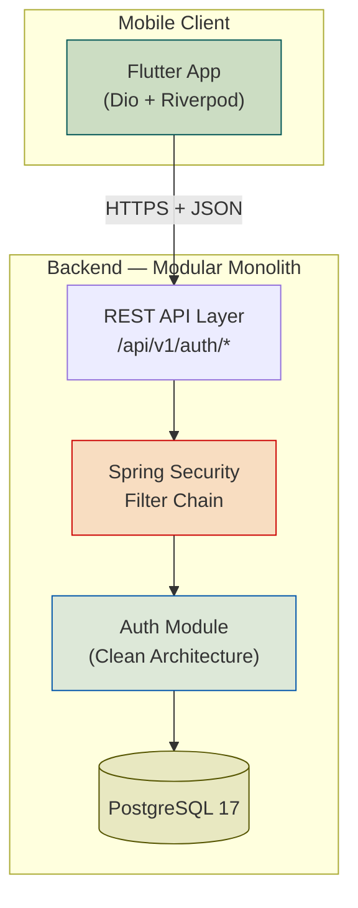
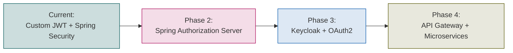
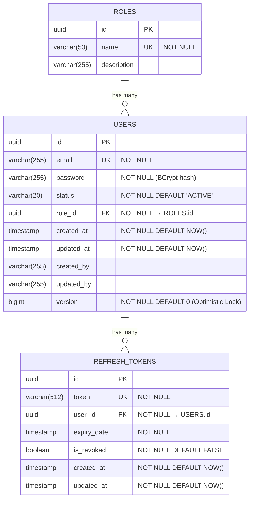
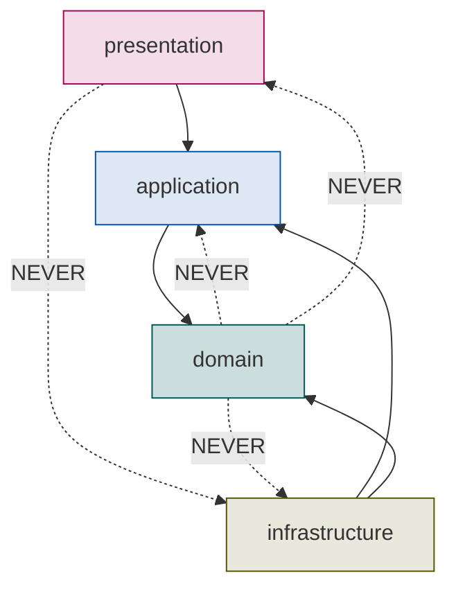
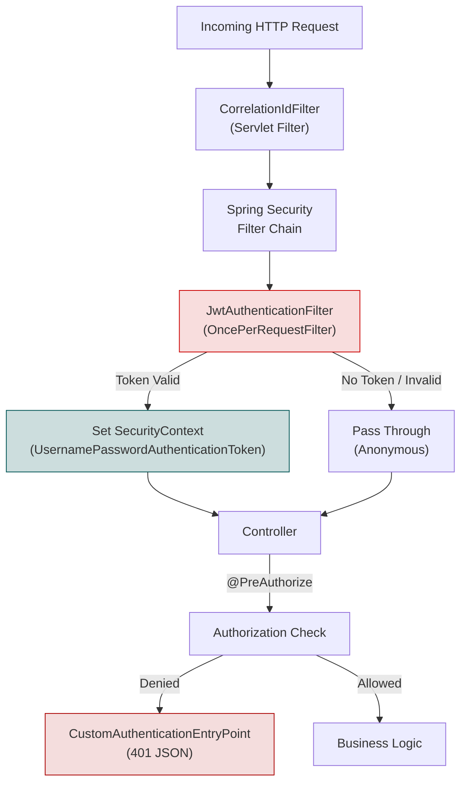
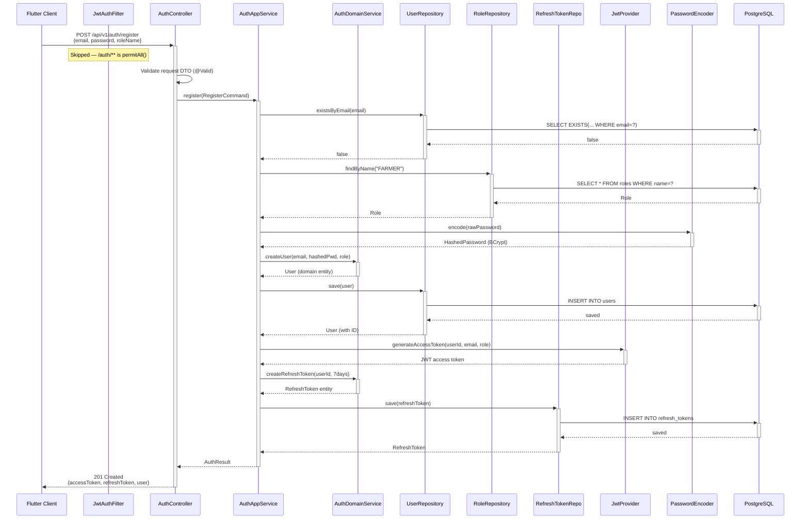
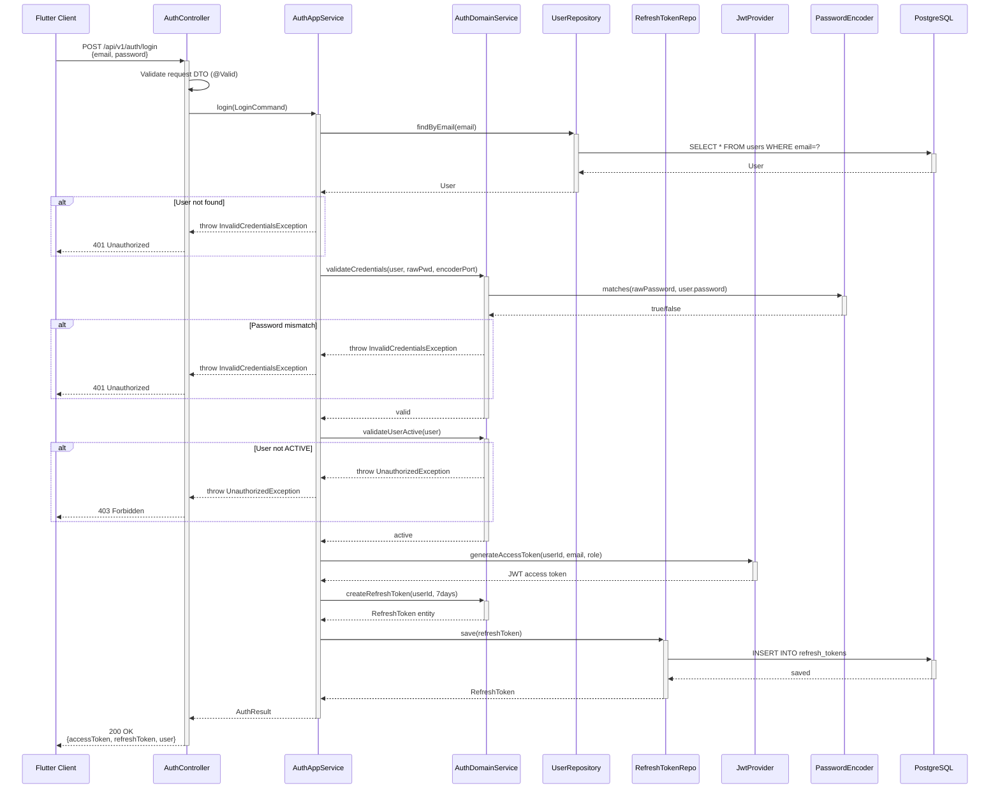
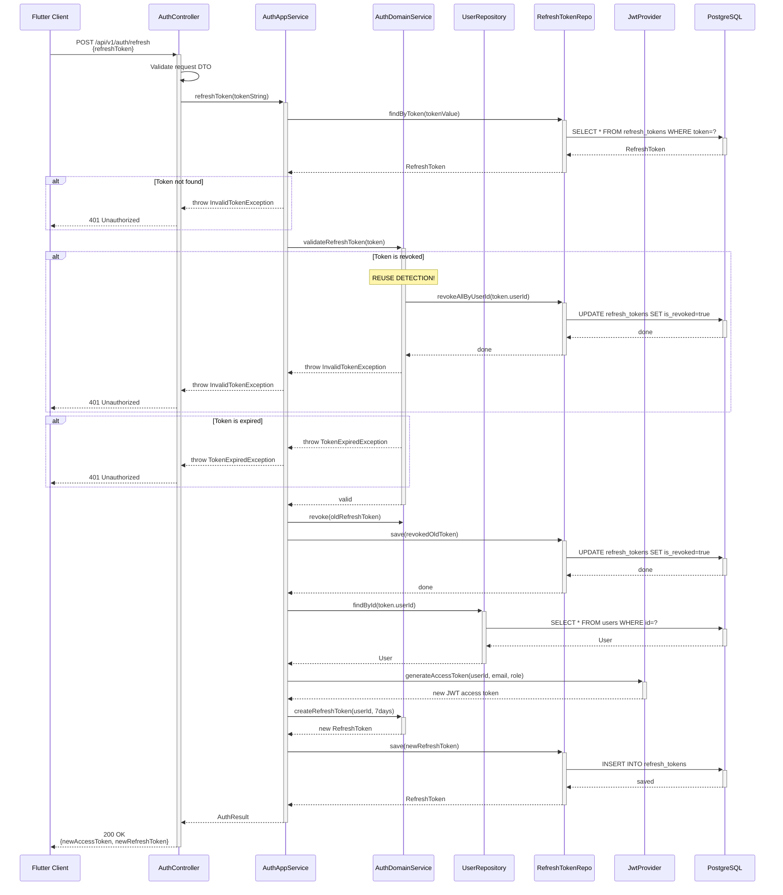
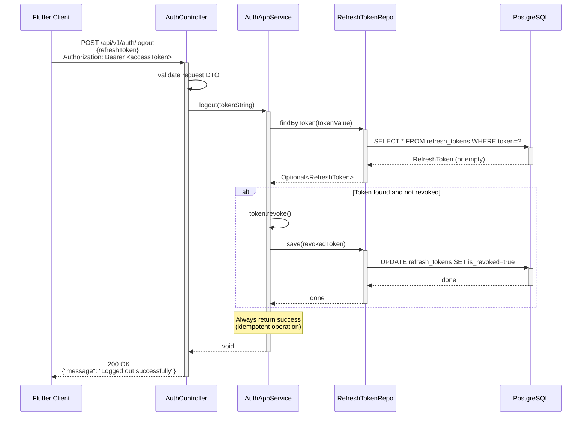

# Authentication Module — AI Farmer Companion

## 1. High-Level Design (HLD)

### 1.1 System Context

AI Farmer Companion is a Flutter mobile application with a Java/Spring Boot backend. The authentication module is the **security boundary** — it governs identity verification (authentication) and permission enforcement (authorization) for every API call.



### 1.2 Authentication Flow — Bird's Eye View

```text
┌────────────┐       ┌─────────────────────┐       ┌────────────┐
│  Flutter    │──────▶│   Spring Boot API    │──────▶│ PostgreSQL │
│  Mobile App │◀──────│   (Auth Module)      │◀──────│   Database │
└────────────┘       └─────────────────────┘       └────────────┘
      │                        │
      │  1. Register/Login     │
      │───────────────────────▶│
      │                        │── validate credentials
      │                        │── generate JWT Access Token (15m)
      │                        │── generate Refresh Token (7d)
      │                        │── persist Refresh Token in DB
      │  2. Response           │
      │◀───────────────────────│
      │  {accessToken,         │
      │   refreshToken}        │
      │                        │
      │  3. API Calls          │
      │───────────────────────▶│
      │  Authorization: Bearer │── JwtAuthenticationFilter intercepts
      │                        │── validates token signature + expiry
      │                        │── sets SecurityContext
      │                        │── proceeds to controller
      │                        │
      │  4. Token Expired      │
      │───────────────────────▶│
      │  POST /auth/refresh    │── validate refresh token from DB
      │  {refreshToken}        │── check not revoked, not expired
      │                        │── issue new access token
      │                        │── rotate refresh token
      │  5. Logout             │
      │───────────────────────▶│
      │  POST /auth/logout     │── revoke refresh token in DB
      │  {refreshToken}        │── return 200 OK
```

### 1.3 Key Architectural Decisions

| Decision | Choice | Rationale |
|----------|--------|-----------|
| Auth mechanism | JWT + Refresh Token (custom) | Simple, stateless, migration-ready for Keycloak/OAuth2 |
| Token storage (server) | Refresh token in DB | Enables revocation, device tracking, audit trail |
| Token storage (client) | Flutter secure storage | Access token in memory, refresh token in secure storage |
| Password hashing | BCrypt (strength 12) | Industry standard, adaptive work factor |
| Architecture | Clean Architecture (4 layers) | Separation of concerns, testability, future migration |
| Role model | Separate `roles` table with FK | Extensible, supports future RBAC/ABAC evolution |
| API versioning | URI path (`/api/v1/`) | Explicit, Flutter client can pin version |
| Session model | Stateless | Horizontal scaling, no server-side session state |

### 1.4 Future Migration Path



> [!IMPORTANT]
> The domain layer (`AuthenticationDomainService`, repository interfaces) is designed to be **infrastructure-agnostic**. When migrating to Keycloak, only the infrastructure layer changes. The domain and application layers remain untouched.

---

## 2. Database Schema

### 2.1 ER Diagram



### 2.2 Flyway Migration Scripts

#### V1__create_roles_table.sql

```sql
CREATE TABLE roles (
    id          UUID PRIMARY KEY DEFAULT gen_random_uuid(),
    name        VARCHAR(50)  NOT NULL UNIQUE,
    description VARCHAR(255)
);
```

#### V2__create_users_table.sql

```sql
CREATE TABLE users (
    id          UUID PRIMARY KEY DEFAULT gen_random_uuid(),
    email       VARCHAR(255) NOT NULL UNIQUE,
    password    VARCHAR(255) NOT NULL,
    status      VARCHAR(20)  NOT NULL DEFAULT 'ACTIVE',
    role_id     UUID         NOT NULL,
    created_at  TIMESTAMP    NOT NULL DEFAULT NOW(),
    updated_at  TIMESTAMP    NOT NULL DEFAULT NOW(),
    created_by  VARCHAR(255),
    updated_by  VARCHAR(255),
    version     BIGINT       NOT NULL DEFAULT 0,

    CONSTRAINT fk_users_role
        FOREIGN KEY (role_id) REFERENCES roles(id)
            ON DELETE RESTRICT
);

CREATE INDEX idx_users_email   ON users(email);
CREATE INDEX idx_users_role_id ON users(role_id);
CREATE INDEX idx_users_status  ON users(status);
```

#### V3__create_refresh_tokens_table.sql

```sql
CREATE TABLE refresh_tokens (
    id          UUID PRIMARY KEY DEFAULT gen_random_uuid(),
    token       VARCHAR(512) NOT NULL UNIQUE,
    user_id     UUID         NOT NULL,
    expiry_date TIMESTAMP    NOT NULL,
    is_revoked  BOOLEAN      NOT NULL DEFAULT FALSE,
    created_at  TIMESTAMP    NOT NULL DEFAULT NOW(),
    updated_at  TIMESTAMP    NOT NULL DEFAULT NOW(),

    CONSTRAINT fk_refresh_tokens_user
        FOREIGN KEY (user_id) REFERENCES users(id)
            ON DELETE CASCADE
);

CREATE INDEX idx_refresh_tokens_token   ON refresh_tokens(token);
CREATE INDEX idx_refresh_tokens_user_id ON refresh_tokens(user_id);
CREATE INDEX idx_refresh_tokens_expiry  ON refresh_tokens(expiry_date);
```

#### V4__seed_roles.sql

```sql
INSERT INTO roles (id, name, description) VALUES
    (gen_random_uuid(), 'ADMIN',      'System administrator with full access'),
    (gen_random_uuid(), 'FARMER',     'Farmer user with standard access'),
    (gen_random_uuid(), 'AGRONOMIST', 'Agronomist with advisory access');
```

### 2.3 Schema Design Decisions

| Decision | Rationale |
|----------|-----------|
| `ON DELETE RESTRICT` on `users.role_id` | Prevent accidental role deletion when users exist |
| `ON DELETE CASCADE` on `refresh_tokens.user_id` | When a user is deleted, all their tokens are automatically cleaned up |
| `version` column on `users` | Optimistic locking — prevents lost updates on concurrent modifications |
| `status` as `VARCHAR(20)` not `ENUM` | PostgreSQL enums are difficult to alter; varchar with application-level validation is more flexible |
| `is_revoked` on refresh tokens | Soft revocation — enables audit trail without deleting records |
| Indexes on `email`, `token`, `user_id`, `expiry_date` | Query performance for the most common lookup patterns |

---

## 3. Clean Architecture — Package Structure

```text
com.farmerai.companion
│
├── auth                                    ← Auth Module (Bounded Context)
│   │
│   ├── presentation                        ← Layer 1: Presentation (Inbound)
│   │   ├── controller
│   │   │   └── AuthController.java              — REST endpoints
│   │   ├── dto
│   │   │   ├── request
│   │   │   │   ├── RegisterRequest.java          — Registration payload
│   │   │   │   ├── LoginRequest.java             — Login payload
│   │   │   │   ├── RefreshTokenRequest.java      — Refresh payload
│   │   │   │   └── LogoutRequest.java            — Logout payload
│   │   │   └── response
│   │   │       ├── AuthResponse.java             — Token pair response
│   │   │       ├── UserResponse.java             — User details response
│   │   │       └── MessageResponse.java          — Generic message response
│   │   └── mapper
│   │       └── AuthPresentationMapper.java       — Domain ↔ DTO mapping (MapStruct)
│   │
│   ├── application                         ← Layer 2: Application (Use Cases)
│   │   ├── service
│   │   │   └── AuthApplicationService.java       — Orchestrates auth use cases
│   │   ├── port
│   │   │   ├── input
│   │   │   │   └── AuthUseCase.java              — Input port interface
│   │   │   └── output
│   │   │       ├── UserRepositoryPort.java       — Output port for user persistence
│   │   │       ├── RoleRepositoryPort.java       — Output port for role lookup
│   │   │       ├── RefreshTokenRepositoryPort.java — Output port for token persistence
│   │   │       └── PasswordEncoderPort.java      — Output port for password hashing
│   │   └── dto
│   │       ├── RegisterCommand.java              — Internal command object
│   │       ├── LoginCommand.java                 — Internal command object
│   │       └── AuthResult.java                   — Internal result object
│   │
│   ├── domain                              ← Layer 3: Domain (Core Business Logic)
│   │   ├── entity
│   │   │   ├── User.java                         — User aggregate root
│   │   │   ├── Role.java                         — Role entity
│   │   │   └── RefreshToken.java                 — Refresh token entity
│   │   ├── valueobject
│   │   │   ├── Email.java                        — Email value object (self-validating)
│   │   │   ├── Password.java                     — Raw password value object
│   │   │   ├── HashedPassword.java               — BCrypt hash value object
│   │   │   ├── TokenValue.java                   — Opaque token string wrapper
│   │   │   └── UserStatus.java                   — Enum: ACTIVE, INACTIVE, SUSPENDED
│   │   ├── service
│   │   │   └── AuthenticationDomainService.java  — Domain-level auth logic
│   │   ├── repository
│   │   │   ├── UserRepository.java               — Domain repository interface
│   │   │   ├── RoleRepository.java               — Domain repository interface
│   │   │   └── RefreshTokenRepository.java       — Domain repository interface
│   │   └── exception
│   │       ├── UserAlreadyExistsException.java
│   │       ├── InvalidCredentialsException.java
│   │       ├── InvalidTokenException.java
│   │       ├── TokenExpiredException.java
│   │       └── UnauthorizedException.java
│   │
│   └── infrastructure                      ← Layer 4: Infrastructure (Outbound)
│       ├── persistence
│       │   ├── entity
│       │   │   ├── UserJpaEntity.java            — JPA entity (DB mapping)
│       │   │   ├── RoleJpaEntity.java            — JPA entity
│       │   │   └── RefreshTokenJpaEntity.java    — JPA entity
│       │   ├── repository
│       │   │   ├── UserJpaRepository.java        — Spring Data JPA repository
│       │   │   ├── RoleJpaRepository.java        — Spring Data JPA repository
│       │   │   └── RefreshTokenJpaRepository.java— Spring Data JPA repository
│       │   ├── adapter
│       │   │   ├── UserRepositoryAdapter.java    — Implements domain UserRepository
│       │   │   ├── RoleRepositoryAdapter.java    — Implements domain RoleRepository
│       │   │   └── RefreshTokenRepositoryAdapter.java — Implements domain RefreshTokenRepository
│       │   └── mapper
│       │       └── AuthPersistenceMapper.java    — JPA Entity ↔ Domain Entity (MapStruct)
│       └── security
│           ├── SecurityConfig.java               — Spring Security filter chain config
│           ├── JwtAuthenticationFilter.java      — OncePerRequestFilter for JWT validation
│           ├── JwtProvider.java                  — Token generation & validation
│           ├── CustomUserDetailsService.java     — Loads user from DB for Spring Security
│           ├── CustomUserDetails.java            — Implements UserDetails
│           ├── PasswordEncoderAdapter.java       — Adapts BCryptPasswordEncoder
│           └── CustomAuthenticationEntryPoint.java — Handles 401 responses
│
├── common                                  ← Shared Module (Cross-Cutting)
│   ├── exception
│   │   ├── GlobalExceptionHandler.java           — @ControllerAdvice
│   │   └── ErrorResponse.java                    — Standard error response DTO
│   ├── logging
│   │   ├── CorrelationIdFilter.java              — Servlet filter for correlation ID
│   │   ├── LoggingInterceptor.java               — Request/response logging
│   │   └── MdcConstants.java                     — MDC key constants
│   └── config
│       └── AppConfig.java                        — Common bean definitions
│
└── FarmerAiCompanionApplication.java       ← Spring Boot main class
```

### 3.1 Dependency Rule



> [!IMPORTANT]
> **The domain layer has ZERO framework dependencies.** No Spring annotations, no JPA annotations, no Lombok on domain entities. Pure Java. This is the single most important architectural constraint.

### 3.2 Layer Responsibilities

| Layer | Responsibility | Depends On | Knows About |
|-------|---------------|------------|-------------|
| **Presentation** | HTTP concerns — request parsing, validation, response formatting, status codes | Application | DTOs, Controllers, Mappers |
| **Application** | Use case orchestration — coordinates domain objects and infrastructure ports | Domain | Commands, ports, application services |
| **Domain** | Core business logic — entities, value objects, domain services, repository interfaces | Nothing | Only itself |
| **Infrastructure** | Technical details — JPA, Spring Security, JWT libraries, BCrypt | Application, Domain | Adapters, JPA entities, configs |

---

## 4. Low-Level Design (LLD)

### 4.1 Domain Entities

#### User (Aggregate Root)

```text
User
├── id: UUID
├── email: Email                    (Value Object)
├── password: HashedPassword        (Value Object)
├── status: UserStatus              (Enum VO: ACTIVE, INACTIVE, SUSPENDED)
├── role: Role                      (Entity reference)
├── createdAt: Instant
├── updatedAt: Instant
├── createdBy: String
├── updatedBy: String
└── version: Long                   (Optimistic locking)

Methods:
├── activate(): void
├── deactivate(): void
├── suspend(): void
├── changeRole(Role): void
├── isActive(): boolean
└── static create(email, hashedPassword, role): User
```

#### Role (Entity)

```text
Role
├── id: UUID
├── name: String                    (ADMIN | FARMER | AGRONOMIST)
└── description: String

Methods:
└── static of(name, description): Role
```

#### RefreshToken (Entity)

```text
RefreshToken
├── id: UUID
├── token: TokenValue               (Value Object)
├── userId: UUID
├── expiryDate: Instant
├── isRevoked: boolean
├── createdAt: Instant
└── updatedAt: Instant

Methods:
├── revoke(): void
├── isExpired(): boolean
├── isUsable(): boolean             → !isRevoked && !isExpired()
└── static create(userId, tokenValue, expiryDate): RefreshToken
```

### 4.2 Value Objects

| Value Object | Validation Rules | Immutable |
|-------------|-----------------|-----------|
| `Email` | Non-null, RFC 5322 regex, max 255 chars, stored lowercase | ✅ |
| `Password` | Non-null, min 8 chars, requires uppercase + lowercase + digit + special char | ✅ |
| `HashedPassword` | Non-null, must start with `$2a$` or `$2b$` (BCrypt prefix) | ✅ |
| `TokenValue` | Non-null, non-blank UUID string | ✅ |
| `UserStatus` | Enum: `ACTIVE`, `INACTIVE`, `SUSPENDED` | ✅ |

> [!NOTE]
> Value objects are **self-validating**. They throw `IllegalArgumentException` in their constructor if invariants are violated. This pushes validation to the domain layer — the earliest possible point.

### 4.3 Domain Service — AuthenticationDomainService

```text
AuthenticationDomainService
│
├── validateUserNotExists(email: Email, userRepo): void
│       → throws UserAlreadyExistsException
│
├── createUser(email, hashedPassword, role): User
│       → factory logic, sets status = ACTIVE
│
├── validateCredentials(user: User, rawPassword, encoderPort): void
│       → throws InvalidCredentialsException
│
├── validateUserActive(user: User): void
│       → throws UnauthorizedException if status != ACTIVE
│
├── createRefreshToken(userId: UUID, expiryDays: int): RefreshToken
│       → generates secure random token, sets expiry
│
└── validateRefreshToken(token: RefreshToken): void
        → throws TokenExpiredException | InvalidTokenException
```

### 4.4 Application Service — AuthApplicationService

This is the **use case orchestrator**. It coordinates domain objects and infrastructure ports but contains **no business logic itself**.

```text
AuthApplicationService implements AuthUseCase
│
├── register(RegisterCommand): AuthResult
│       1. Validate email not taken       (domain service)
│       2. Hash password                  (password encoder port)
│       3. Look up default role           (role repository port)
│       4. Create User                    (domain service + user repository port)
│       5. Generate tokens                (JWT provider + domain service)
│       6. Persist refresh token          (refresh token repository port)
│       7. Return AuthResult
│
├── login(LoginCommand): AuthResult
│       1. Find user by email             (user repository port)
│       2. Validate credentials           (domain service)
│       3. Validate user active           (domain service)
│       4. Generate tokens                (JWT provider + domain service)
│       5. Persist refresh token          (refresh token repository port)
│       6. Return AuthResult
│
├── refreshToken(String refreshToken): AuthResult
│       1. Find refresh token in DB       (refresh token repository port)
│       2. Validate token                 (domain service)
│       3. Revoke old refresh token       (domain service)
│       4. Load user                      (user repository port)
│       5. Generate new token pair        (JWT provider + domain service)
│       6. Persist new refresh token      (refresh token repository port)
│       7. Return AuthResult
│
└── logout(String refreshToken): void
        1. Find refresh token in DB       (refresh token repository port)
        2. Revoke token                   (domain service)
        3. Persist revocation             (refresh token repository port)
```

### 4.5 Repository Interfaces (Domain Layer)

```text
UserRepository
├── save(User): User
├── findByEmail(Email): Optional<User>
├── findById(UUID): Optional<User>
└── existsByEmail(Email): boolean

RoleRepository
├── findByName(String): Optional<Role>
└── findAll(): List<Role>

RefreshTokenRepository
├── save(RefreshToken): RefreshToken
├── findByToken(TokenValue): Optional<RefreshToken>
├── revokeAllByUserId(UUID): void
└── deleteExpiredTokens(): int
```

---

## 5. API Design

### 5.1 Endpoints

#### POST `/api/v1/auth/register`

**Request:**
```json
{
    "email": "farmer@example.com",
    "password": "StrongP@ss1",
    "roleName": "FARMER"
}
```

**Validation Rules:**
| Field | Rules |
|-------|-------|
| `email` | `@NotBlank`, `@Email`, max 255 |
| `password` | `@NotBlank`, `@Size(min=8, max=100)`, `@Pattern` (uppercase + lowercase + digit + special) |
| `roleName` | `@NotBlank`, must be one of: FARMER, AGRONOMIST |

> [!NOTE]
> `ADMIN` role cannot be self-assigned during registration. Admin users are created through a separate admin provisioning flow.

**Success Response — `201 CREATED`:**
```json
{
    "accessToken": "eyJhbGciOiJIUzI1NiIs...",
    "refreshToken": "550e8400-e29b-41d4-a716-446655440000",
    "tokenType": "Bearer",
    "expiresIn": 900,
    "user": {
        "id": "123e4567-e89b-12d3-a456-426614174000",
        "email": "farmer@example.com",
        "role": "FARMER",
        "status": "ACTIVE"
    }
}
```

**Error Response — `409 CONFLICT`:**
```json
{
    "timestamp": "2026-06-20T14:30:00Z",
    "status": 409,
    "error": "Conflict",
    "message": "User with email 'farmer@example.com' already exists",
    "path": "/api/v1/auth/register",
    "correlationId": "abc-123-def"
}
```

---

#### POST `/api/v1/auth/login`

**Request:**
```json
{
    "email": "farmer@example.com",
    "password": "StrongP@ss1"
}
```

**Validation Rules:**
| Field | Rules |
|-------|-------|
| `email` | `@NotBlank`, `@Email` |
| `password` | `@NotBlank` |

**Success Response — `200 OK`:**
```json
{
    "accessToken": "eyJhbGciOiJIUzI1NiIs...",
    "refreshToken": "550e8400-e29b-41d4-a716-446655440000",
    "tokenType": "Bearer",
    "expiresIn": 900,
    "user": {
        "id": "123e4567-e89b-12d3-a456-426614174000",
        "email": "farmer@example.com",
        "role": "FARMER",
        "status": "ACTIVE"
    }
}
```

**Error Response — `401 UNAUTHORIZED`:**
```json
{
    "timestamp": "2026-06-20T14:30:00Z",
    "status": 401,
    "error": "Unauthorized",
    "message": "Invalid email or password",
    "path": "/api/v1/auth/login",
    "correlationId": "abc-123-def"
}
```

> [!WARNING]
> The error message is deliberately vague ("Invalid email or password") — never reveal whether the email exists. This prevents **user enumeration attacks**.

---

#### POST `/api/v1/auth/refresh`

**Request:**
```json
{
    "refreshToken": "550e8400-e29b-41d4-a716-446655440000"
}
```

**Validation Rules:**
| Field | Rules |
|-------|-------|
| `refreshToken` | `@NotBlank` |

**Success Response — `200 OK`:**
```json
{
    "accessToken": "eyJhbGciOiJIUzI1NiIs...",
    "refreshToken": "661f9511-f30c-52e5-b827-557766551111",
    "tokenType": "Bearer",
    "expiresIn": 900
}
```

> [!IMPORTANT]
> **Refresh Token Rotation:** Every refresh call issues a **new** refresh token and revokes the old one. This limits the window of a stolen refresh token.

**Error Response — `401 UNAUTHORIZED`:**
```json
{
    "timestamp": "2026-06-20T14:30:00Z",
    "status": 401,
    "error": "Unauthorized",
    "message": "Refresh token is expired or revoked",
    "path": "/api/v1/auth/refresh",
    "correlationId": "abc-123-def"
}
```

---

#### POST `/api/v1/auth/logout`

**Request:**
```json
{
    "refreshToken": "550e8400-e29b-41d4-a716-446655440000"
}
```

**Success Response — `200 OK`:**
```json
{
    "message": "Logged out successfully"
}
```

> [!NOTE]
> Logout always returns `200 OK` even if the token is already revoked or invalid. This prevents information leakage and simplifies client logic.

### 5.2 Standard Error Response Format

Every error response follows this structure:

```json
{
    "timestamp": "ISO-8601 timestamp",
    "status": 400,
    "error": "Human readable HTTP status",
    "message": "Specific error message",
    "path": "/api/v1/auth/...",
    "correlationId": "UUID correlation ID from MDC",
    "fieldErrors": [
        {
            "field": "email",
            "message": "must be a valid email address",
            "rejectedValue": "not-an-email"
        }
    ]
}
```

The `fieldErrors` array is present only for `400 BAD_REQUEST` validation failures.

---

## 6. JWT Design

### 6.1 Token Architecture

| Property | Access Token | Refresh Token |
|----------|-------------|---------------|
| Format | JWT (signed) | Opaque UUID |
| Expiry | 15 minutes | 7 days |
| Storage (client) | In-memory (Flutter state) | Secure storage (flutter_secure_storage) |
| Storage (server) | Not stored | PostgreSQL `refresh_tokens` table |
| Revocable | No (stateless, short-lived) | Yes (DB flag `is_revoked`) |
| Rotated | Every refresh | Every refresh |

### 6.2 JWT Access Token — Claims

```json
{
    "sub": "123e4567-e89b-12d3-a456-426614174000",
    "email": "farmer@example.com",
    "role": "FARMER",
    "iat": 1718882400,
    "exp": 1718883300,
    "iss": "ai-farmer-companion",
    "jti": "unique-token-id"
}
```

| Claim | Type | Purpose |
|-------|------|---------|
| `sub` | String (UUID) | User ID — primary identifier |
| `email` | String | User email — for display / logging |
| `role` | String | User role — for RBAC in the filter chain |
| `iat` | Long (epoch) | Issued-at timestamp |
| `exp` | Long (epoch) | Expiration timestamp (iat + 15 min) |
| `iss` | String | Issuer identifier — `ai-farmer-companion` |
| `jti` | String (UUID) | Unique token ID — for logging / debugging |

### 6.3 Signing Strategy

| Property | Value |
|----------|-------|
| Algorithm | HMAC-SHA256 (`HS256`) |
| Secret | 256-bit key from `application.yml` (externalized) |
| Future migration | Switch to RS256 (asymmetric) when adopting Keycloak |

### 6.4 Token Validation Strategy (JwtProvider)

```text
validateToken(token: String): boolean
│
├── 1. Parse token with signing key
│       → catches SignatureException         → false
│       → catches MalformedJwtException      → false
│
├── 2. Check expiration
│       → catches ExpiredJwtException        → false
│
├── 3. Check issuer matches "ai-farmer-companion"
│       → mismatch                           → false
│
├── 4. Extract claims
│       → sub (userId) must be non-null
│       → role must be non-null
│
└── 5. Return true
```

### 6.5 Refresh Token Strategy

```text
Refresh Token = UUID.randomUUID().toString()
```

- **Not a JWT** — opaque, random, no information leakage
- Stored in DB → enables server-side revocation
- **Rotation policy**: old token is revoked, new token is issued on every refresh
- **Reuse detection**: if a revoked refresh token is presented, **all tokens for that user are revoked** (compromised token scenario)

> [!CAUTION]
> Refresh token reuse detection is critical for security. If a revoked token is presented, it means the original token was likely stolen. Revoking all tokens forces the user to re-authenticate on all devices.

---

## 7. Spring Security Architecture

### 7.1 Component Diagram



### 7.2 Component Responsibilities

#### SecurityConfig

```text
Responsibility: Defines the Spring Security filter chain configuration

Key decisions:
├── Disable CSRF (stateless API, no cookies)
├── Disable form login (mobile app, not web)
├── Disable HTTP basic auth
├── Set session management to STATELESS
├── Configure endpoint authorization rules:
│   ├── /api/v1/auth/**          → permitAll()
│   ├── /swagger-ui/**           → permitAll()
│   ├── /v3/api-docs/**          → permitAll()
│   ├── /actuator/health         → permitAll()
│   └── everything else          → authenticated()
├── Register JwtAuthenticationFilter BEFORE UsernamePasswordAuthenticationFilter
├── Register CustomAuthenticationEntryPoint for 401 handling
└── Configure CORS for Flutter development
```

#### JwtAuthenticationFilter

```text
Responsibility: Intercepts every request, extracts JWT from Authorization header,
                validates it, and sets the SecurityContext

Flow:
├── 1. Extract "Authorization" header
├── 2. Check it starts with "Bearer "
├── 3. Extract token string
├── 4. Call JwtProvider.validateToken(token)
├── 5. If valid:
│   ├── Extract userId, email, role from claims
│   ├── Create UsernamePasswordAuthenticationToken
│   ├── Set SecurityContextHolder
│   └── Continue filter chain
├── 6. If invalid / missing:
│   └── Continue filter chain (anonymous request)
└── 7. Clear MDC after request completes (finally block)
```

#### JwtProvider

```text
Responsibility: Encapsulates all JWT operations — generation, validation, parsing

Methods:
├── generateAccessToken(userId, email, role): String
│       → creates JWT with claims, signs with HS256, sets 15min expiry
├── generateRefreshToken(): String
│       → returns UUID.randomUUID().toString()
├── validateToken(token: String): boolean
│       → parses, checks signature + expiry + issuer
├── getUserIdFromToken(token: String): UUID
├── getEmailFromToken(token: String): String
├── getRoleFromToken(token: String): String
└── getExpirationFromToken(token: String): Date

Configuration (from application.yml):
├── jwt.secret: Base64-encoded 256-bit key
├── jwt.access-token.expiration-ms: 900000  (15 minutes)
├── jwt.refresh-token.expiration-ms: 604800000  (7 days)
└── jwt.issuer: ai-farmer-companion
```

#### CustomUserDetailsService

```text
Responsibility: Bridge between Spring Security and our domain UserRepository

Method:
└── loadUserByUsername(email: String): UserDetails
    ├── Find user by email in repository
    ├── Map to CustomUserDetails (implements UserDetails)
    └── Throw UsernameNotFoundException if not found

Note: Used by Spring Security internals for authentication.
      In our stateless JWT flow, this is primarily used during login
      to load the user for credential validation.
```

#### CustomAuthenticationEntryPoint

```text
Responsibility: Returns a structured JSON 401 response when authentication fails

Instead of Spring's default HTML error page, writes:
{
    "timestamp": "...",
    "status": 401,
    "error": "Unauthorized",
    "message": "Authentication required to access this resource",
    "path": "/api/v1/...",
    "correlationId": "..."
}
```

#### PasswordEncoderAdapter

```text
Responsibility: Adapts Spring's BCryptPasswordEncoder to the domain's PasswordEncoderPort

Implements: PasswordEncoderPort (application layer output port)
Delegates to: BCryptPasswordEncoder (strength=12)

Methods:
├── encode(Password rawPassword): HashedPassword
└── matches(Password rawPassword, HashedPassword encoded): boolean
```

---

## 8. Sequence Diagrams

### 8.1 Register Flow



### 8.2 Login Flow



### 8.3 Refresh Token Flow



### 8.4 Logout Flow



---

## 9. Logging Strategy

### 9.1 Architecture

```text
┌──────────────────────────────────────────────┐
│              Incoming Request                 │
│  CorrelationIdFilter (Servlet Filter)         │
│  ├── Extract X-Correlation-ID from header     │
│  ├── Or generate UUID if missing              │
│  ├── Put into MDC: correlationId              │
│  ├── Generate requestId (always new UUID)     │
│  └── Put into MDC: requestId                  │
└──────────────────────────────────────────────┘
                    │
                    ▼
┌──────────────────────────────────────────────┐
│              LoggingInterceptor               │
│  (HandlerInterceptor)                         │
│  preHandle:                                   │
│  ├── Log: method, URI, client IP              │
│  └── Store start time                         │
│  postHandle:                                  │
│  └── Log: status, duration                    │
└──────────────────────────────────────────────┘
                    │
                    ▼
┌──────────────────────────────────────────────┐
│              Application Code                 │
│  Uses SLF4J Logger                            │
│  MDC auto-populates: correlationId, requestId │
│  Log format (logback-spring.xml):             │
│  %d{ISO8601} [%thread] %-5level              │
│  [%X{correlationId}] [%X{requestId}]         │
│  %logger{36} - %msg%n                        │
└──────────────────────────────────────────────┘
```

### 9.2 MDC Constants

| Key | Source | Purpose |
|-----|--------|---------|
| `correlationId` | `X-Correlation-ID` header or generated UUID | Traces a request across services (future microservices) |
| `requestId` | Always generated UUID | Uniquely identifies each HTTP request |
| `userId` | Extracted from JWT in `JwtAuthenticationFilter` | Associates log entries with a user |

### 9.3 Key Logging Points

| Component | Log Level | What is Logged |
|-----------|-----------|---------------|
| `CorrelationIdFilter` | `DEBUG` | Correlation ID assigned |
| `AuthController` | `INFO` | Register/Login/Refresh/Logout attempt |
| `AuthApplicationService` | `INFO` | Use case entry + outcome |
| `JwtAuthenticationFilter` | `DEBUG` | Token validation result |
| `JwtProvider` | `WARN` | Token validation failures (expired, malformed) |
| `GlobalExceptionHandler` | `ERROR` | Unhandled exceptions with full stack trace |

> [!WARNING]
> **NEVER log:** passwords, full JWT tokens, refresh token values, or PII beyond email. Log only token JTI (unique ID) for audit purposes.

---

## 10. Exception Handling

### 10.1 Exception Hierarchy

```text
RuntimeException
└── AuthenticationModuleException (abstract base)
    ├── UserAlreadyExistsException       → 409 CONFLICT
    ├── InvalidCredentialsException       → 401 UNAUTHORIZED
    ├── InvalidTokenException             → 401 UNAUTHORIZED
    ├── TokenExpiredException             → 401 UNAUTHORIZED
    └── UnauthorizedException             → 403 FORBIDDEN
```

### 10.2 GlobalExceptionHandler

```text
@RestControllerAdvice
GlobalExceptionHandler
│
├── handleUserAlreadyExists(e)
│   → 409 CONFLICT
│   → ErrorResponse with message
│
├── handleInvalidCredentials(e)
│   → 401 UNAUTHORIZED
│   → Generic "Invalid email or password" (security)
│
├── handleInvalidToken(e)
│   → 401 UNAUTHORIZED
│   → ErrorResponse with message
│
├── handleTokenExpired(e)
│   → 401 UNAUTHORIZED
│   → ErrorResponse with "Token expired"
│
├── handleUnauthorized(e)
│   → 403 FORBIDDEN
│   → ErrorResponse with message
│
├── handleMethodArgumentNotValid(e)
│   → 400 BAD_REQUEST
│   → ErrorResponse with fieldErrors[]
│
├── handleConstraintViolation(e)
│   → 400 BAD_REQUEST
│   → ErrorResponse with fieldErrors[]
│
└── handleGenericException(e)
    → 500 INTERNAL_SERVER_ERROR
    → "An unexpected error occurred" (never expose internals)
    → Log full stack trace at ERROR level
```

### 10.3 ErrorResponse Structure

```text
ErrorResponse
├── timestamp: Instant        (ISO-8601)
├── status: int               (HTTP status code)
├── error: String             (HTTP status reason phrase)
├── message: String           (Human-readable error message)
├── path: String              (Request URI)
├── correlationId: String     (From MDC)
└── fieldErrors: List<FieldError>  (Only for validation errors)
    └── FieldError
        ├── field: String
        ├── message: String
        └── rejectedValue: Object
```

---

## 11. Testing Strategy

### 11.1 Test Pyramid

```text
                    ┌───────────┐
                    │    E2E    │  ← Manual / Flutter integration tests
                    │  (few)    │
                ┌───┴───────────┴───┐
                │  Integration Tests │  ← Spring Boot Test + Testcontainers
                │   (moderate)       │
            ┌───┴───────────────────┴───┐
            │      Unit Tests            │  ← JUnit 5 + Mockito
            │    (most tests here)       │
            └───────────────────────────┘
```

### 11.2 Unit Tests

| Component | What to Test | Mocking |
|-----------|-------------|---------|
| `Email` (Value Object) | Valid/invalid formats, null, empty, case normalization | None (pure logic) |
| `Password` (Value Object) | Validation rules, boundary cases | None |
| `User` (Entity) | `create()`, `activate()`, `deactivate()`, status transitions | None |
| `RefreshToken` (Entity) | `isExpired()`, `isUsable()`, `revoke()` | None |
| `AuthenticationDomainService` | `validateCredentials()`, `createUser()`, `validateRefreshToken()` | `PasswordEncoderPort` |
| `AuthApplicationService` | Full register/login/refresh/logout flows | All repository ports, JwtProvider, DomainService |
| `JwtProvider` | Token generation, validation, claim extraction, expired tokens | None (uses test secret) |
| `AuthController` | Request validation, response mapping, status codes | `AuthUseCase` |
| `GlobalExceptionHandler` | Each exception → correct HTTP status + response body | None |

### 11.3 Integration Tests

| Test | Scope | Tools |
|------|-------|-------|
| `AuthControllerIT` | Full HTTP round-trip: register → login → refresh → logout | `@SpringBootTest`, `WebTestClient`, Testcontainers (PostgreSQL) |
| `UserRepositoryAdapterIT` | JPA ↔ Domain mapping, queries, constraints | `@DataJpaTest`, Testcontainers (PostgreSQL) |
| `RefreshTokenRepositoryAdapterIT` | Token CRUD, revocation queries, expiry cleanup | `@DataJpaTest`, Testcontainers (PostgreSQL) |
| `SecurityConfigIT` | Protected endpoints return 401, public endpoints accessible | `@SpringBootTest`, `MockMvc` |
| `FlywayMigrationIT` | All migrations run cleanly on fresh DB | Testcontainers (PostgreSQL) |

### 11.4 Testcontainers Setup

```text
PostgreSQL 17 container
├── Reusable across test classes (singleton pattern)
├── Flyway migrations auto-applied
├── Test data loaded via @Sql or test fixtures
└── Parallel test execution safe (each test gets own transaction, rolled back)
```

---

## 12. Design Patterns Used

| Pattern | Where Applied | Why |
|---------|--------------|-----|
| **Repository Pattern** | `UserRepository`, `RoleRepository`, `RefreshTokenRepository` (domain interfaces) + `*Adapter` (infrastructure implementations) | Decouples domain from persistence technology. Enables swapping JPA for any other data source without touching business logic. |
| **Adapter Pattern** | `UserRepositoryAdapter`, `PasswordEncoderAdapter`, `CustomAuthenticationEntryPoint` | Bridges the gap between domain interfaces (ports) and infrastructure implementations. Core pattern of Hexagonal/Clean Architecture. |
| **Ports & Adapters (Hexagonal)** | Input ports (`AuthUseCase`), Output ports (`*RepositoryPort`, `PasswordEncoderPort`) | Makes dependencies flow inward. Domain knows nothing about Spring, JPA, or JWT libraries. |
| **Builder Pattern** | Domain entities (`User.create(...)`, `RefreshToken.create(...)`) use static factory methods. DTOs use Lombok `@Builder`. | Controlled object construction with validation. Prevents partially constructed objects. |
| **Factory Method** | `User.create()`, `RefreshToken.create()` | Encapsulates creation logic and invariant validation inside the entity itself. |
| **Strategy Pattern** | `PasswordEncoderPort` — currently backed by BCrypt, can be swapped | Algorithm independence. Could switch to Argon2id without touching domain/application layers. |
| **Template Method** | `JwtAuthenticationFilter extends OncePerRequestFilter` | Spring's filter template — we override `doFilterInternal()` while the framework handles filter chain lifecycle. |
| **Value Object Pattern** | `Email`, `Password`, `HashedPassword`, `TokenValue`, `UserStatus` | Self-validating, immutable types that make illegal states unrepresentable. Compiler-enforced type safety (can't pass a raw string where an Email is expected). |
| **Command Pattern** | `RegisterCommand`, `LoginCommand` | Encapsulates use case input as an object. Decouples presentation DTOs from application layer. Enables future command bus / CQRS. |
| **Singleton Pattern** | Spring beans (`@Service`, `@Component`) are singletons by default | Spring IoC manages lifecycle. Stateless services are safe as singletons. |
| **Filter Chain Pattern** | Spring Security filter chain + `CorrelationIdFilter` + `JwtAuthenticationFilter` | Each filter handles one concern (correlation ID, JWT, CSRF). Composable, ordered, single-responsibility. |

---

## 13. Design Decisions & Tradeoffs

### 13.1 Why Custom JWT Instead of Spring Authorization Server?

| Factor | Custom JWT | Spring Authorization Server |
|--------|-----------|---------------------------|
| Complexity | Low — ~10 classes | High — OAuth2 flows, consent, token introspection |
| Learning curve | Moderate — you learn JWT internals | Steep — OAuth2 spec is vast |
| Time to production | Days | Weeks |
| Migration to Keycloak | Swap infrastructure layer | Already OAuth2-compliant, but different config |
| **Our choice** | **✅ Custom JWT** | Future phase |

**Tradeoff**: We own token management code (security risk if bugs exist), but gain simplicity and deep understanding.

### 13.2 Why Opaque Refresh Token Instead of JWT?

**Choice**: UUID string stored in database.

| Factor | Opaque (UUID) | JWT Refresh Token |
|--------|--------------|-------------------|
| Revocability | Instant — flip DB flag | Requires blocklist (adds complexity) |
| Information leakage | None — opaque string | Contains claims if intercepted |
| DB dependency | Yes — every refresh hits DB | No — stateless validation |
| **Our choice** | **✅ Opaque UUID** | Not chosen |

**Tradeoff**: Every refresh requires a DB read, but refresh happens at most every 15 minutes — negligible load.

### 13.3 Why Refresh Token Rotation?

Every time the client calls `/auth/refresh`:
1. The old refresh token is **revoked**
2. A new refresh token is **issued**

If a previously-revoked token is presented → **all user tokens are revoked** (reuse detection).

**Benefit**: Limits the damage window of a stolen refresh token to a single use.  
**Tradeoff**: More DB writes (revoke + insert on every refresh). Acceptable at this scale.

### 13.4 Why Domain Entities Separate from JPA Entities?

| Factor | Single Entity (JPA annotations on domain) | Separate Entities |
|--------|------------------------------------------|-------------------|
| Code volume | Less code | More code (mappers needed) |
| Purity of domain | Polluted with `@Entity`, `@Column` | Clean, framework-free |
| Testability | Requires JPA context for some tests | Domain tests are plain JUnit |
| Migration effort | High — domain coupled to JPA | Low — swap infrastructure |
| **Our choice** | Not chosen | **✅ Separate entities** |

**Tradeoff**: More boilerplate (MapStruct mappers), but the domain layer is **completely portable** — critical for future Keycloak/microservice migration.

### 13.5 Why BCrypt (strength 12)?

| Strength | Time per Hash | Security |
|----------|--------------|----------|
| 10 (default) | ~100ms | Good for most apps |
| **12 (our choice)** | **~250ms** | **Better security, acceptable latency** |
| 14 | ~1s | Overkill for mobile app login |

**Tradeoff**: Login takes ~250ms extra for hashing. Acceptable — login is infrequent. Protects against brute-force if DB is compromised.

### 13.6 Why `status` as VARCHAR Instead of PostgreSQL ENUM?

PostgreSQL `ENUM` types:
- Cannot be altered easily (`ALTER TYPE ... ADD VALUE` doesn't work in transactions before PG 12+)
- Complicate Flyway migrations
- Don't exist in other databases (testing with H2)

`VARCHAR(20)` with application-level validation:
- Flyway migrations are simple `INSERT/UPDATE`
- Works with Testcontainers (PostgreSQL) and any test DB
- Domain enum `UserStatus` enforces valid values at the application boundary

---

## 14. Configuration (application.yml)

```yaml
# Key properties to configure
app:
  jwt:
    secret: ${JWT_SECRET}                    # Externalized, never in source control
    access-token:
      expiration-ms: 900000                  # 15 minutes
    refresh-token:
      expiration-ms: 604800000              # 7 days
    issuer: ai-farmer-companion

spring:
  datasource:
    url: jdbc:postgresql://${DB_HOST:localhost}:${DB_PORT:5432}/${DB_NAME:farmerai}
    username: ${DB_USER}
    password: ${DB_PASSWORD}
  flyway:
    enabled: true
    locations: classpath:db/migration
  jpa:
    hibernate:
      ddl-auto: validate                     # Flyway manages schema, Hibernate validates
    open-in-view: false                      # Prevent lazy loading in controllers
```

> [!CAUTION]
> `JWT_SECRET` must be a Base64-encoded string of at least 256 bits (32 bytes). Never hardcode it. Use environment variables or a secrets manager.

---

## 15. Verification Plan

### 15.1 Automated Tests

```bash
# Unit tests
./mvnw test

# Integration tests (requires Docker for Testcontainers)
./mvnw verify -Pfailsafe

# All tests
./mvnw verify
```

### 15.2 Manual Verification

1. **Start PostgreSQL** via Docker Compose
2. **Run application** → verify Flyway migrations execute cleanly
3. **Swagger UI** → test all 4 endpoints manually:
   - Register → verify 201 + tokens
   - Login → verify 200 + tokens
   - Use access token on a protected endpoint → verify 200
   - Wait 15 min (or shorten expiry) → verify 401
   - Refresh → verify new tokens
   - Logout → verify refresh token revoked
   - Try to use revoked refresh token → verify 401
4. **Check logs** → verify correlation ID, request ID, structured format

---

## Open Questions

> [!IMPORTANT]
> **Q1: First Name / Last Name fields** — Should the `users` table include `first_name` and `last_name` columns? The current schema has only `email` as the identifier. If user profile data is needed, should it live in the `users` table or a separate `user_profiles` table?

> [!IMPORTANT]
> **Q2: Admin registration** — The current design blocks `ADMIN` role during self-registration. How should the first admin be created? Options:
> - A) Flyway seed script inserts a default admin user
> - B) A CLI command to create admin users
> - C) A separate protected admin-creation endpoint

> [!IMPORTANT]
> **Q3: Rate limiting** — Should we implement rate limiting on auth endpoints (e.g., 5 login attempts per minute per IP) in this phase, or defer to API Gateway phase?

> [!IMPORTANT]
> **Q4: Email verification** — Should registration require email verification (OTP / link) before activating the account? This significantly impacts the registration flow.

> [!IMPORTANT]
> **Q5: Multi-device support** — The schema supports multiple refresh tokens per user (one per device). Should we add a `device_info` or `device_id` column to `refresh_tokens` now to prepare for this, or add it later?
